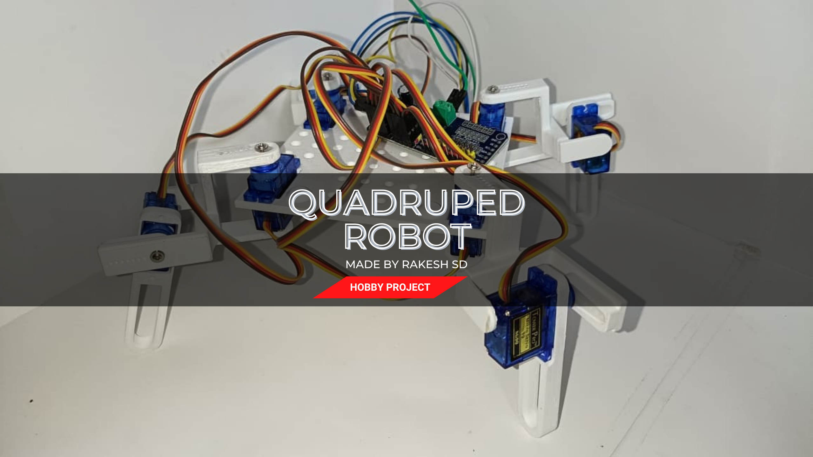
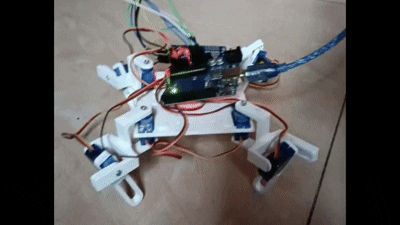
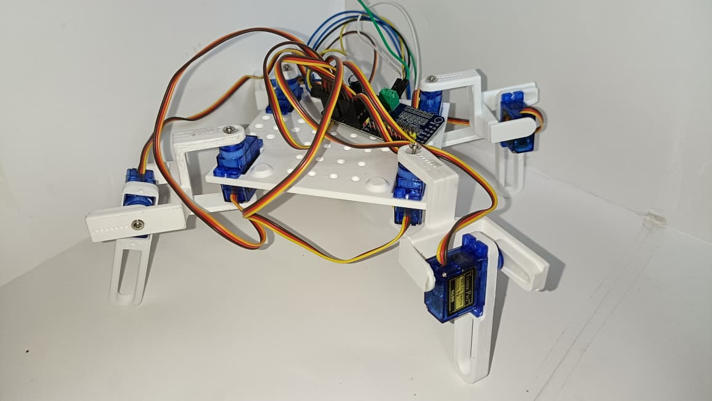
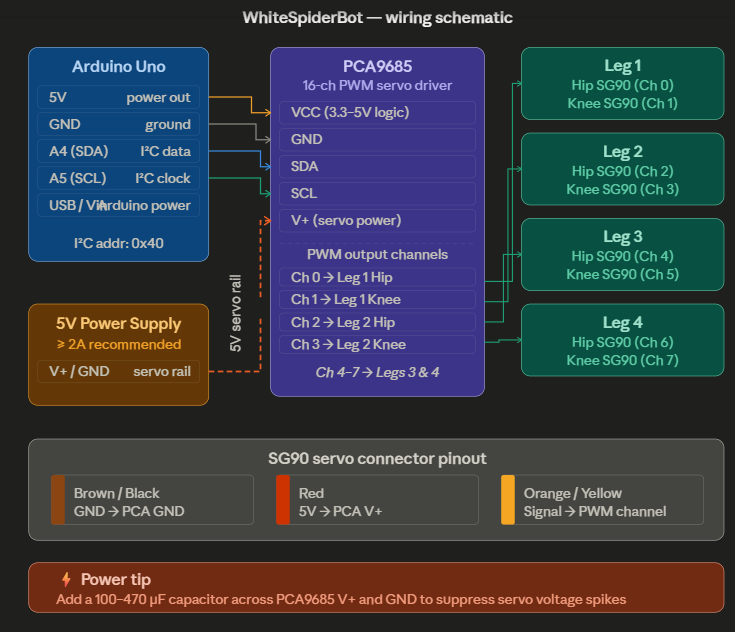

# 🕷️ Quadruped WhiteSpiderBot

<div align="center">



**An 8-DOF 3D-printed quadruped spider robot powered by SG90 servos, Arduino, and PCA9685 servo driver**

[](https://opensource.org/licenses/MIT)
[](https://www.arduino.cc/)
[](https://www.adafruit.com/product/815)
[](https://www.st.com/)

</div>

---

## 📌 Table of Contents

- [About the Project](#-about-the-project)
- [Demo](#-demo)
- [Features](#-features)
- [Hardware Components](#-hardware-components)
- [Circuit Diagram](#-circuit-diagram)
- [3D Printed Parts / CAD Files](#-3d-printed-parts--cad-files)
- [Software & Dependencies](#-software--dependencies)
- [Getting Started](#-getting-started)
- [Gait & Movement](#-gait--movement)
- [Roadmap](#-roadmap)
- [Contributing](#-contributing)
- [License](#-license)

---

## 🤖 About the Project

**WhiteSpiderBot** is a fully 3D-printed quadruped (4-legged) spider robot inspired by arachnid locomotion. Each leg has **2 degrees of freedom** — a hip servo and a knee servo — totalling **8 SG90 servo motors**. The robot is controlled by an **Arduino** communicating over I²C with a **PCA9685 16-channel PWM servo driver**, allowing precise and efficient servo control without consuming all Arduino PWM pins.

The mechanical chassis is designed for modularity and easy assembly, making it an ideal open-source platform for learning robotics, inverse kinematics, and gait algorithms.

---

## 🎬 Demo


### Walking Demo

<!-- Add your GIF here -->



### Assembly & Build

<!-- Add build photos here -->
| Isometric View | Electronics |
|:---:|:---:|
|  |  |


## ✨ Features

- **8 SG90 servo motors** — 2 per leg (hip + knee), 4 legs total
- **PCA9685 PWM driver** — I²C-controlled 16-channel servo board, frees up Arduino pins
- **Fully 3D-printed chassis** — lightweight, modular, easy to reprint/replace parts
- **Arduino-based firmware** — simple and accessible codebase for hobbyists
- **Configurable gait sequences** — walk, turn, and idle animations
- **Compact & low-cost build** — great for beginners and makers

---

## 🔩 Hardware Components

| Component | Quantity | Notes |
|---|---|---|
| SG90 Micro Servo Motor | 8 | 2 per leg (hip + knee) |
| PCA9685 16-Channel PWM Servo Driver | 1 | I²C interface |
| Arduino Uno / Nano | 1 | Microcontroller |
| 3D Printed Chassis Parts | — | See CAD section below |
| 5V 2A+ Power Supply / Li-Po Battery | 1 | Servos need stable 5V |
| Jumper Wires | — | — |
optionals
| Breadboard / PCB | 1 | For wiring |
| Capacitor (100–470 µF) | 1 | Servo power stabilization |

> ⚠️ **Power Note:** 8 SG90 servos can draw up to ~1.6A under load. Use a dedicated 5V power supply for the PCA9685 V+ rail — do NOT power servos from the Arduino 5V pin.

---

## 🔌 Circuit Diagram

```
Arduino                PCA9685
--------               --------
5V     ──────────────► VCC
GND    ──────────────► GND
A4 (SDA) ────────────► SDA
A5 (SCL) ────────────► SCL

PCA9685                Servos
--------               --------
Channel 0  ──────────► Leg 1 - Thigh
Channel 1  ──────────► Leg 1 - Thigh
Channel 2  ──────────► Leg 2 - Thigh
Channel 3  ──────────► Leg 2 - Thigh
Channel 4  ──────────► Leg 3 - Leg
Channel 5  ──────────► Leg 3 - Leg
Channel 6  ──────────► Leg 4 - Leg
Channel 7  ──────────► Leg 4 - Leg

External 5V PSU ─────► PCA9685 V+ (servo power rail)
```
---

## 🖨️ 3D Printed Parts / CAD Files

All mechanical parts are designed in [CAD Software] and are available in both **STL** (for printing) and **STEP** (for editing) formats.

### 📦 Download CAD Files

[](https://grabcad.com/rakesh.s.d-2)

> 🔗 **[Download from GrabCAD →](https://grabcad.com/library/quadruped-robot-using-sg90s-motor-1)**

### Printed Parts List

| Part | Qty | File |
|---|---|---|
| Body / Main Chassis | 1 | `base.stl` |
|Thigh | 4 | `thigh.stl` |
| leg | 4 | `leg.stl` |

### Print Settings (Recommended)

- **Material:** PLA or PETG
- **Infill:** 30–40%
- **Layer Height:** 0.2mm
- **Supports:** Yes (for servo brackets)
- **Print Orientation:** As provided in STL files

---

## 💻 Software & Dependencies

### Arduino Libraries

Install these via the Arduino Library Manager:

```
Adafruit PWM Servo Driver Library   (by Adafruit)
Wire                                (built-in)
```

### Installation

```bash
# Clone the repository
git clone https://github.com/rakesh001n/Quadruped-WhiteSpiderBot.git
cd Quadruped-WhiteSpiderBot
```

Then open the `.ino` file in the Arduino IDE.

---

## 🚀 Getting Started

### 1. Assemble the Hardware

- Print all chassis parts and assemble the 4 legs
- Mount SG90 servos into the hip and knee brackets
- Connect servos to the PCA9685 channels as per the wiring diagram

### 2. Wire the Electronics

- Connect PCA9685 to Arduino via I²C (SDA → A4, SCL → A5)
- Power the PCA9685 servo rail with an external 5V supply
- Power the Arduino separately via USB or Vin

### 3. Calibrate the Servos

Open `servo_calibration.ino` and upload it to individually test and center each servo before attaching the leg linkages.

```cpp
// Set center position for all servos
pwm.setPWM(channel, 0, SERVO_CENTER); // SERVO_CENTER = 307 (approx 90°)
```

### 4. Upload the Main Firmware

Open `WhiteSpiderBot/WhiteSpiderBot.ino` in Arduino IDE, select your board and port, and upload.

### 5. Power On

Power on the robot — it should initialize to the home stance and begin its default walking gait.

---

## 🦵 Gait & Movement

The robot uses a **creep gait** (alternating tripod or diagonal leg sequences) for stable locomotion:

```
Gait Sequence (Walk Forward):
  Step 1: Lift Leg 1 → Move Forward → Place
  Step 2: Lift Leg 3 → Move Forward → Place
  Step 3: Lift Leg 2 → Move Forward → Place
  Step 4: Lift Leg 4 → Move Forward → Place
  Repeat
```


## 🗺️ Roadmap

- [x] 8-DOF mechanical design (4 legs × 2 DOF)
- [x] Arduino + PCA9685 servo control
- [x] Basic walking gait
- [ ] **STM32 integration** — migrate firmware to STM32 for faster control loops and more processing power
- [ ] Remote control via Bluetooth / wifi
- [ ] ESP32 Wi-Fi / ROS integration
      
---

## 🤝 Contributing

Contributions are welcome! Feel free to open issues, suggest features, or submit pull requests.

---

## 📄 License

Distributed under the MIT License. See `LICENSE` for more information.

---

## 🙏 Acknowledgements

- [Adafruit PCA9685 Library](https://github.com/adafruit/Adafruit-PWM-Servo-Driver-Library)
- Inspired by the open-source quadruped robotics community

---

<div align="center">
Made with ❤️ by <a href="https://github.com/rakesh001n">rakesh001n</a>
</div>
